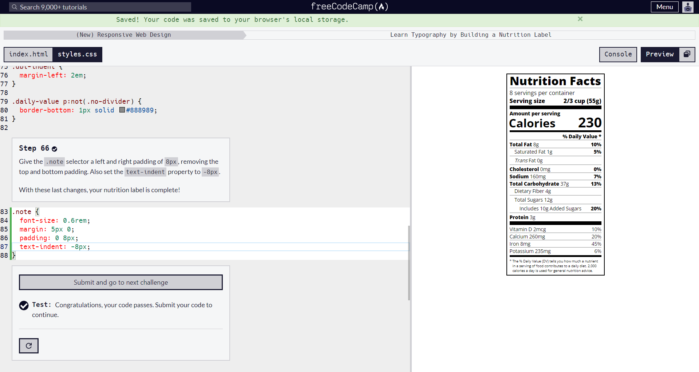

# #100DaysOfCode

[Commit #100DaysOfCode challenge](https://twitter.com/dwz_wong_01/status/1586789021719887872)

## Table Of Content
- [Logs](#logs)

## Logs

### Day 1:

<table>
    <tr>
        <td></td>
        <td></td>
    </tr>
    <tr>
        <td></td>
        <td></td>
    </tr>
</table>

### Responsive Web Design:
- Learn the CSS Box Model by Building a Rothko Painting
- Learn CSS Flexbox by Building a Photo Gallery
- Learn Typography by Building a Nutrition Label
- Learn Accessibility by Building a Quiz

### Day 2:

### Sololearn:
- HTML (Hypertext Markup Language)
    - Overview
    - HTML Basics
    - Challenges
    - HTML5
